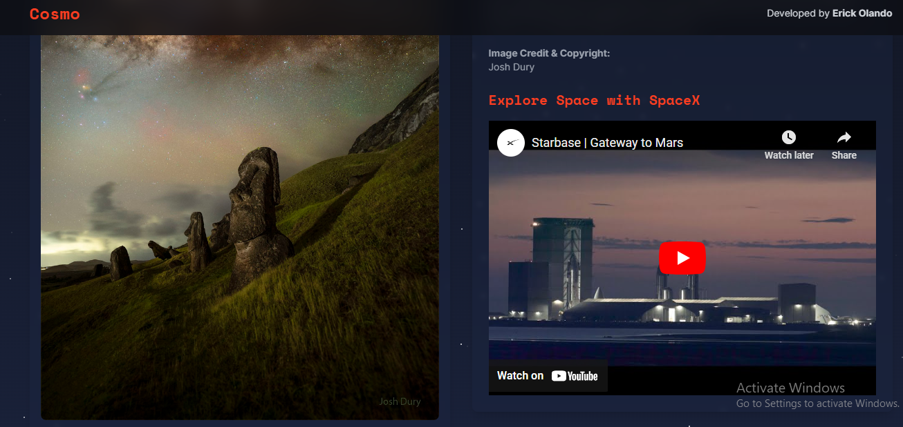

# Cosmo: NASA Astronomy Picture of the Day Viewer

Cosmo is a web application that showcases NASA's Astronomy Picture of the Day (APOD) in a visually stunning and interactive manner. This project aims to make the wonders of space more accessible and engaging for everyone.



## Features

- Daily updated astronomy picture with detailed explanation
- Responsive design for optimal viewing on all devices
- Interactive starry background with twinkling stars and shooting stars
- Embedded YouTube video featuring SpaceX content
- Random space facts to enhance user engagement
- Accessibility features for an inclusive user experience

## Technologies Used

- HTML5
- CSS3 (with Tailwind CSS)
- JavaScript (ES6+)
- EJS (Embedded JavaScript templating)
- YouTube IFrame API
- NASA APOD API

## Prerequisites

Before you begin, ensure you have met the following requirements:

- Node.js (v14.0.0 or higher)
- npm (v6.0.0 or higher)
- A NASA API key (obtainable from [NASA API Portal](https://api.nasa.gov/))

## Installation

1. Clone the repository:
   ```
   git clone https://github.com/your-username/cosmicview.git
   ```

2. Navigate to the project directory:
   ```
   cd cosmicview
   ```

3. Install the dependencies:
   ```
   npm install
   ```

4. Create a `.env` file in the root directory and add your NASA API key:
   ```
   NASA_API_KEY=your_api_key_here
   ```

## Usage

1. Start the development server:
   ```
   npm run dev
   ```

2. Open your browser and visit `http://localhost:3000` to view the application.

## Deployment

To deploy CosmicView to a production environment:

1. Build the project:
   ```
   npm run build
   ```

2. Start the production server:
   ```
   npm start
   ```

## Contributing

Contributions to CosmicView are welcome! Here's how you can contribute:

1. Fork the repository
2. Create a new branch (`git checkout -b feature/AmazingFeature`)
3. Make your changes
4. Commit your changes (`git commit -m 'Add some AmazingFeature'`)
5. Push to the branch (`git push origin feature/AmazingFeature`)
6. Open a Pull Request

Please ensure your code adheres to the existing style and passes all tests.

## Acknowledgments

- NASA for providing the Astronomy Picture of the Day API
- SpaceX for the inspiring video content
- [Tailwind CSS](https://tailwindcss.com/) for the utility-first CSS framework
- [YouTube IFrame API](https://developers.google.com/youtube/iframe_api_reference) for video embedding

## Contact

Erick Olando - Olandoerick98@gmail.com

Project Link: https://erickolando.up.railway.app/

---

Enjoy exploring the cosmos with Cosmo! 🚀🌌
